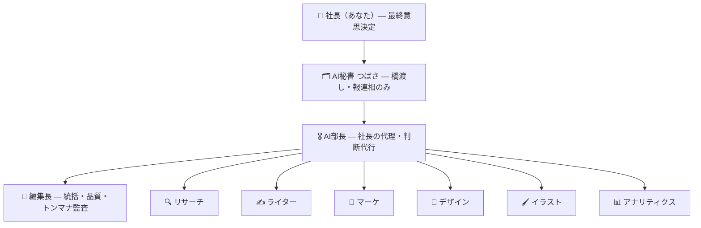

# 🏢 Revo AI カンパニー — 本社（HQ）

社長（あなた）の事業を動かすAI組織の“本社”。ここに各メンバーの職務・判断基準・学習が**永続保存**され、仕事のたびに読み込まれて賢くなる（＝育つ）。

> このHQは `revolist-diagnosis` に versioning しているが、**全プロジェクト共通の本社**として機能する（revosong / okurimono / revofunding も対象）。

---

## 組織図

---

## 動き方（依頼が流れる順番）

1. **社長 → つばさ**：要望を伝える（一言でOK）
2. **つばさ → 部長**：意図を整理して渡す（橋渡し）。つばさは判断も制作もしない
3. **部長**：`preferences.md`（社長の意思）を読み、**代理判断**（何を・誰が・どの順で・どこまで自動で進めるか）。社長の判断が要る所だけ、つばさ経由でエスカレーション
4. **担当各部**：自分の憲章＋成長ログを読んで実行。**編集長**が品質・トンマナを監査
5. **部長**：統合を承認し、`bucho.md` の判断ログに記録
6. **つばさ → 社長**：結果を要約報告＋次の選択肢を提示
7. **育成**：つばさが社長のフィードバックを `preferences.md` と各 `成長ログ` に反映

> 次からは、社長はつばさに要望を伝えるだけでよい。あとは部長が担当を動かす。

---

## 「育てる」仕組み（永続メモリ）

- **`preferences.md`** … 社長の意思・方針・好みの“共有脳”。全員が最初に読む長期記憶。
- **各 `roles/*.md` の「成長ログ」** … その担当が学んだことを日付つきで追記。次回スポーン時に読み込む。
- **`bucho.md` の「判断ログ」** … 部長が下した代理判断と、社長のフィードバックを蓄積。判断の精度を上げる。

毎サイクル、この3つに学びを追記する。ファイルが厚くなるほど、各メンバーの判断が社長に近づく。

---

## ファイル地図

| ファイル | 役割 |
|---------|------|
| `README.md` | 本社の全体像（この文書） |
| `tsubasa.md` | 🗂 秘書つばさの職務（橋渡しのみ） |
| `bucho.md` | 🎖 部長の憲章＋判断基準＋判断ログ |
| `preferences.md` | 👤 社長の意思・方針（共有脳／長期記憶） |
| `roles/editor.md` | 📝 編集長 |
| `roles/research.md` | 🔍 リサーチ |
| `roles/writer.md` | ✍️ ライター |
| `roles/marketing.md` | 📣 マーケ |
| `roles/design.md` | 🎨 デザイン |
| `roles/illustration.md` | 🖌 イラスト |
| `roles/analytics.md` | 📊 アナリティクス |

---

## スキルで起動する（自走の仕組み）

このカンパニーは **`revo-company` スキル**で起動する。Revo事業の作業（発信・制作・調査・執筆・デザイン・分析・企画）を頼まれたら、これを呼ぶだけで上記フローが回る。

- スキル本体：`.claude/skills/revo-company/SKILL.md`
- スキルは起動時にまず**「読みに行く場所」**を読み込む：
  1. `company/preferences.md`（社長の意思・共有脳）
  2. `company/bucho.md`（部長の判断基準・判断ログ）
  3. `company/roles/<担当>.md`（担当の憲章・成長ログ）
  4. `company/playbooks/`（作業の型＝SOPと案件別プレイブック）
- 「どうすればいいか」は、まず `company/playbooks/` を見る。無ければ一度やって手順を書き足す（＝会社が育つ）。

> 設計思想：口約束の体制は揮発する。**スキル（起動）＋ナレッジ（読みに行く場所）＋成長ログ（学習）**をファイルで永続化することで、カンパニーは毎回同じ品質で立ち上がり、回すほど賢くなる。

## 現在進行中の案件
- **Threads発信キャンペーン**（`@____hayator`／レボリスト診断）… 設計一式は `../docs/threads-campaign/` に格納済み。プレイブックは `playbooks/threads-campaign.md`。
  - 状態：ローンチ準備スプリント（部長判断 #002）は**保留**。社長指示により、まず本カンパニーの自走設計を固めることを優先。
