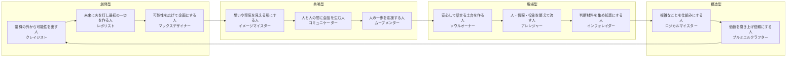

# レボリスト11 役割マップ v0

## 目的

レボリスト11の役割を、単なる一覧ではなく「どの力から生まれ、どの役割と隣り合い、どの役割と補完し合うか」が見える形にする。

Wealth Dynamics のように、役割を地図として見せることで、診断結果からマッチング・席順・チーム設計へつなげる。

## 4つの動き方

レボリスト11では、4周波数をそのまま使わず、以下の動き方として表現する。

| 動き方 | 近い周波数 | 意味 |
|---|---|---|
| 創発型 | ダイナモ | まだないものを生む、始める、未来を出す |
| 共鳴型 | ブレイズ | 人を巻き込む、伝える、応援する |
| 現場型 | テンポ | 状況を見る、安心を作る、継続させる |
| 構造型 | スチール | 整える、仕組みにする、磨き上げる |

## 11役割の円環配置

一般の人には、名前より先に「どんな働きをする人か」を伝える。

名称は後から添える。



## 対角に置く補完関係

円環の近い役割は「わかり合いやすい」関係。

対角に近い役割は「違いが大きいが、補完が強い」関係。

| 起点 | 補完候補 | 起きること |
|---|---|---|
| レボリスト | ロジカルマイスター / アレンジャー | 未来が設計され、続く流れになる |
| クレイジスト | マックスデザイナー / ロジカルマイスター | 違和感が企画や仕組みに変わる |
| イメージマイスター | プルミエルクラフター / コミュニケーター | 世界観が品質になり、人へ届く |
| コミュニケーター | ソウルオーナー / インフォレイダー | 会話が安心や判断材料へ変わる |
| ムーブメンター | レボリスト / ソウルオーナー | 応援が挑戦や継続へ変わる |
| アレンジャー | レボリスト / ロジカルマイスター | 役割が動き、仕組みとして続く |

## 5つの力との対応

| 力 | 主に現れる役割 |
|---|---|
| はじめる力 | レボリスト / クレイジスト |
| 描く力 | マックスデザイナー / イメージマイスター |
| つなぐ力 | コミュニケーター / アレンジャー |
| 整える力 | インフォレイダー / ロジカルマイスター / アレンジャー |
| 支える力 | ムーブメンター / プルミエルクラフター / ソウルオーナー |

## 診断結果での見せ方

結果画面では、以下の3点を同時に見せる。

1. あなたの現在地
2. 近い役割
3. 補完してくれる役割

例:

```text
あなたは「現場型のアレンジャー」寄りです。
近い役割: コミュニケーター / インフォレイダー
補完役割: レボリスト / ロジカルマイスター
3人目にいると動きやすい人: ソウルオーナー
```

## UI案

- 円環マップ
- 現在地を強調
- 隣接役割を淡く表示
- 補完役割を線でつなぐ
- 3人目候補を別色で表示
- 役割名より先に、説明文を大きく表示する
- 名称はサブテキストとして添える

オフ会版では、席順生成後に「この卓の力の地図」として見せる。

合コン版では、「話しやすい相手」「引き出してくれる相手」「自分が引き出せる相手」として見せる。

ワークショップ版では、「発想」「整理」「接続」「実行」「支援」の不足を見せる。
