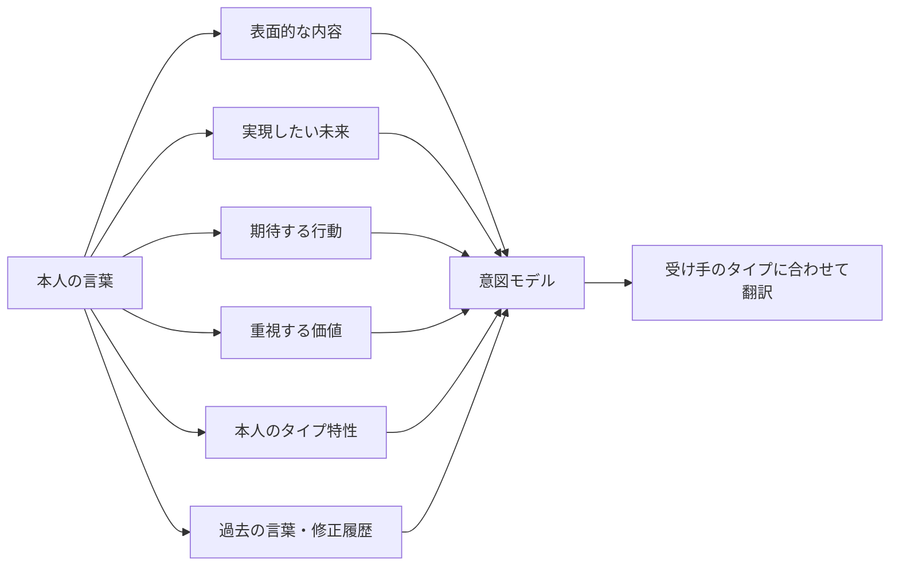

# タイプ間コミュニケーション翻訳エンジン設計

## 目的

レボリスト診断を、単に11タイプを判定する診断ではなく、人と人の間にある言葉のズレを読み解く「翻訳OS」へ拡張する。

目指す価値は、発言者が完璧に言葉を整理できなくても、本人が本当に伝えたかった意図を読み解き、受け手が動きやすい言葉へ変換すること。

```text
相手が伝えたかったことを、
その人のタイプと言葉の特徴から読み解き、
受け手が理解しやすい言葉へ翻訳する。
```

これは、相手を操作するための仕組みではない。互いの言葉を受け取りやすくし、誤解や差し戻しを減らし、違う役割同士が力を持ち寄りやすくするための設計である。

## 中核コンセプト

同じ言葉でも、タイプによって意図が異なる可能性がある。

たとえば「もっと面白くしたい」という言葉は、表面だけ見ると曖昧だが、タイプごとに次のような意図が含まれている可能性がある。

| タイプ | あり得る意図 |
|---|---|
| レボリスト | まず動き出したい |
| マックスデザイナー | 可能性を広げたい |
| イメージマイスター | 世界観を強くしたい |
| ロジカルマイスター | 企画の構造を組み直したい |
| プルミエルクラフター | 完成度を高めたい |

ただし、これは決めつけではない。タイプは初期仮説として扱い、本人の実際の言葉、修正履歴、過去の判断を優先して更新する。

## 翻訳フロー

AIは、発言を表面の文章だけで判断しない。次の層へ分解し、意図モデルを作る。



## 11タイプの言葉の傾向

初期仮説として、以下の観察軸を持つ。

| タイプ | 言葉に現れやすい焦点 | 指示へ変換するときの確認 |
|---|---|---|
| レボリスト | 未来、挑戦、始動、熱量 | 最初に何を動かすか |
| マックスデザイナー | 可能性、展開、アイデア | 今回どの案を選ぶか |
| イメージマイスター | 雰囲気、世界観、感覚 | 見た人に何を感じてほしいか |
| コミュニケーター | 人、会話、つながり | 誰と誰をつなぐか |
| インフォレイダー | 情報、比較、根拠 | 判断に必要な情報は何か |
| ムーブメンター | 応援、行動、前進 | 誰のどんな一歩を促すか |
| プルミエルクラフター | 細部、品質、完成度 | どの基準まで仕上げるか |
| ロジカルマイスター | 構造、順番、再現性 | 条件、手順、完了基準は何か |
| アレンジャー | 配置、段取り、全体調整 | 誰が、いつ、何を担当するか |
| ソウルオーナー | 気持ち、安心、本音 | 何を守り、どう受け止めるか |
| クレイジスト | 違和感、常識外、新しい視点 | 何を壊し、何を残すか |

この表は固定判定には使わない。読み解きの入口として使い、本人の言葉と結果から更新していく。

## 指示理解エンジン

発言を受け取ったら、次の形式へ変換する。

```text
本人の原文:
「もっとレボリスト診断らしく、可能性が広がる感じにしたい」

推定される意図:
世界観を整えるだけでなく、見た人が自分の可能性を感じる表現にしたい。

実行指示:
- 現在案を残す
- 可能性を感じる見出しを3案作る
- ネガティブな表現を使わない
- 11タイプに優劣をつけない
- 見た人が次の行動を想像できる構成にする

未確定:
- デザイン変更も含むか
- 今回は3案を比較するのか、1案まで完成させるのか

確認質問:
「今回は、言葉だけを変えますか。それとも画像の世界観まで変えますか？」
```

確認質問は毎回出さない。結果を大きく変える不明点だけを確認する。

## 受け手に合わせた翻訳

同じ指示でも、受け手のタイプによって動きやすい言葉が変わる。

例: 新しいInstagram企画を始める

| 受け手タイプ | 翻訳例 |
|---|---|
| レボリスト | 11タイプの可能性を広げる新シリーズを、まず1投稿から始めてください。 |
| ロジカルマイスター | 目的、対象者、投稿構成、完了条件を整理し、再利用できる投稿設計を作ってください。 |
| イメージマイスター | 見た瞬間にタイプの空気が伝わる、統一された世界観を設計してください。 |
| インフォレイダー | 類似投稿、読者ニーズ、最新傾向を調べ、企画判断に使える根拠をまとめてください。 |
| アレンジャー | 11投稿を制作順、担当、期限、承認タイミングに分けて進行表を作ってください。 |

この翻訳によって、発信者がすべてを整理できていなくても、受け手が動き出せる指示へ変換できる。

## 初期MVP

最初は、診断本体やDBへ直結させない。まずは小さく検証する。

### 入力

- 発言者タイプ
- 受け手タイプ
- 本人の原文
- 目的、任意
- 過去の修正メモ、任意

### 出力

- 表面的な内容
- 推定される意図
- 実行指示
- 未確定事項
- 確認質問
- 受け手タイプ向けの翻訳文
- AIの確信度

### 初期画面候補

```text
/communication/translate
```

ただし、初期段階では本番ナビゲーションには出さない。検証用の内部ページとして扱う。

## 保存方式

初期は端末内だけに保存する。Supabaseへはまだ保存しない。

理由:

- 発言の原文や修正履歴は個人的なデータになりやすい
- 翻訳ルールはまだ仮説段階
- どの情報が本当に必要かを検証してからDB化した方が安全
- 保存先を分離しておけば、後からSupabaseへ移行できる

### 初期保存

候補:

- IndexedDB
- localStorageは軽いメモ用に限定

推奨:

```text
IndexedDB を主保存先にする。
localStorage は設定値や一時状態に留める。
```

### 保存層の分離

将来の移行を見越して、保存処理は直接画面に書かない。

```text
TranslationRepository
  - LocalTranslationRepository
  - SupabaseTranslationRepository, 将来
```

画面や翻訳ロジックは `TranslationRepository` を通して保存する。これにより、保存先をローカルからSupabaseへ変えても、画面側の変更を最小にできる。

## 保存データ構造案

原文、解釈、翻訳後の指示は必ず分けて保存する。

```ts
type TranslationSession = {
  id: string;
  createdAt: string;
  updatedAt: string;
  speakerTypeKey: string | null;
  receiverTypeKey: string | null;
  originalText: string;
  surfaceContent: string;
  inferredIntent: string;
  translatedInstruction: string;
  unresolvedPoints: string[];
  confirmationQuestions: string[];
  confidence: number;
  userCorrection?: string;
  receiverFeedback?: {
    understood: boolean | null;
    comment?: string;
  };
  executionResult?: {
    completed: boolean | null;
    notes?: string;
  };
  misunderstandingPoints?: string[];
  nextTranslationRules?: string[];
  source: "local";
  schemaVersion: "translation-session-v1";
};
```

## データ収集と成長

将来的には次の組み合わせを蓄積する。

- 発言者のタイプ
- 受け手のタイプ
- 発言の原文
- AIが推定した意図
- 翻訳した指示
- 発言者による修正
- 受け手が理解できたか
- 実行結果
- 誤解が起きた場所
- 次回有効な翻訳ルール

成功指標は、AIが当てたかどうかだけではない。

- 確認の往復回数が減ったか
- 指示後に迷わず動けたか
- 差し戻しが減ったか
- 本人が「言いたかったのはこれ」と感じたか
- タイプの異なる相手同士で理解が深まったか

## Supabase移行方針

Supabaseへ移行する場合も、最初から全データを送らない。

段階案:

1. ローカル保存のみ
2. ユーザーが明示的に許可したセッションだけエクスポート
3. 匿名化した検証データだけSupabaseへ保存
4. ユーザー単位の履歴保存を追加
5. チーム単位の翻訳ルールを追加

Supabase移行時の注意:

- 原文は個人情報に近い可能性がある
- チーム内の関係性や誤解の記録は慎重に扱う
- 本人が訂正・削除できる必要がある
- 共有範囲を明確にする
- 匿名統計と個別履歴を分ける

## 守るべき原則

- タイプだけで本人の意図を断定しない
- タイプ特性より、本人の実際の言葉と修正履歴を優先する
- AIの解釈には確信度を付ける
- 原文、解釈、翻訳後の指示を分離して保存する
- 本人が翻訳ルールを訂正・削除できる
- 伝わらない原因を、一方の能力不足にしない
- 相手を操作するための言葉ではなく、相互理解のために使う
- ネガティブ表現でタイプを固定しない
- 11タイプに優劣をつけない

## 将来の3段階

最終的な価値は、次の3段階へ広げる。

```text
1. 自分の思考をAIへ伝える
2. AIがチーム全体に伝わる指示へ翻訳する
3. 人と人の言葉を、互いが理解しやすい形へ翻訳する
```

## 実装フェーズ案

### Phase 1: 設計docs

このdocsで思想、データ構造、保存方針を定義する。

### Phase 2: 翻訳ルール定義

11タイプごとの言葉の傾向、確認質問、受け手別翻訳テンプレートをデータ化する。

候補ファイル:

```text
src/data/communicationTranslationRules.ts
```

### Phase 3: ローカル保存Repository

IndexedDBを使った保存層を作る。

候補ファイル:

```text
src/lib/communicationTranslationRepository.ts
```

### Phase 4: 内部検証ページ

本番ナビには出さず、内部検証ページとして翻訳を試せる画面を作る。

候補:

```text
src/app/communication/translate/page.tsx
```

### Phase 5: フィードバック収集

本人の修正、受け手の理解度、実行結果を記録する。

### Phase 6: Supabase移行検討

ローカル検証で必要項目が固まってから、匿名統計またはユーザー許可済みデータとしてSupabase保存を設計する。

## 今回まだ実装しないこと

- DBスキーマ作成
- Supabase保存
- API作成
- 本番ナビゲーションへの追加
- 診断ロジック変更
- 11タイプ定義の変更
- 既存結果ページの変更
- おのくん系診断への適用

