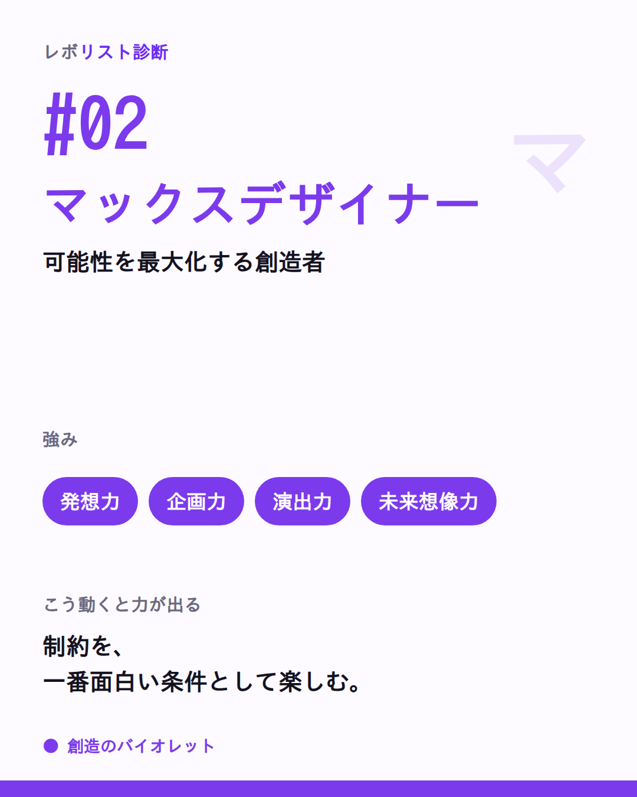
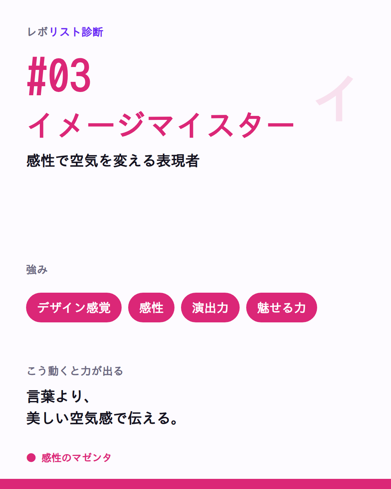
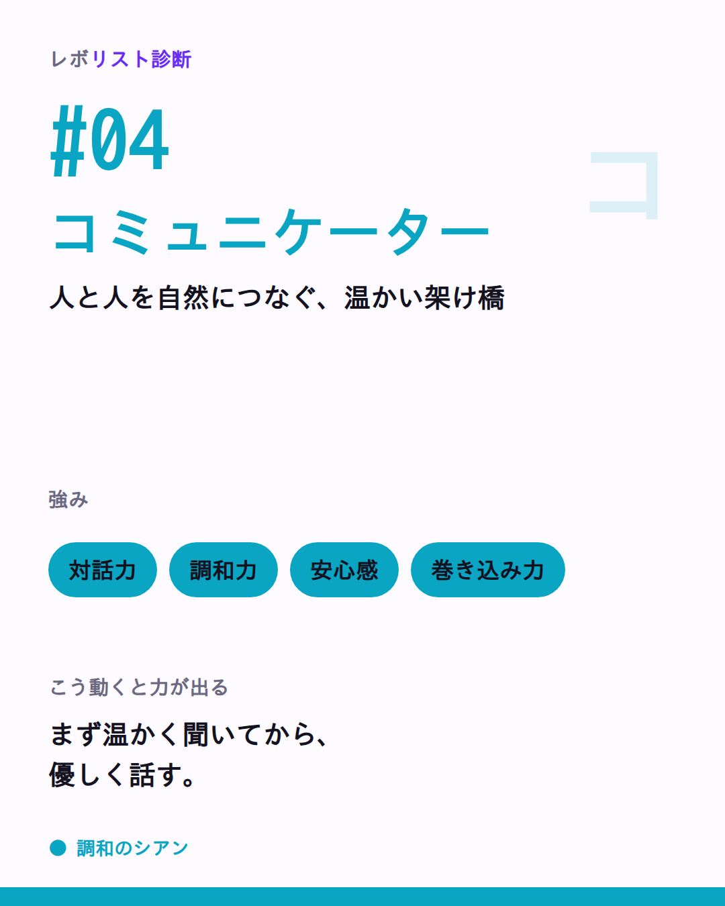
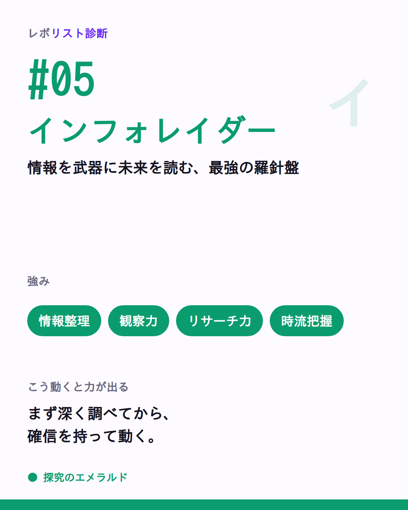
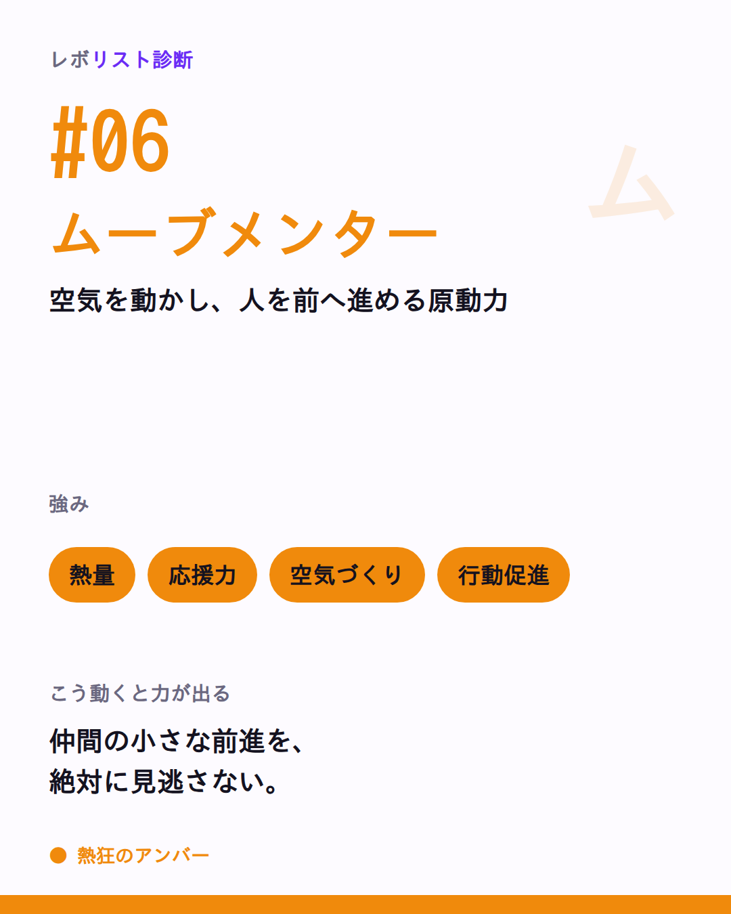
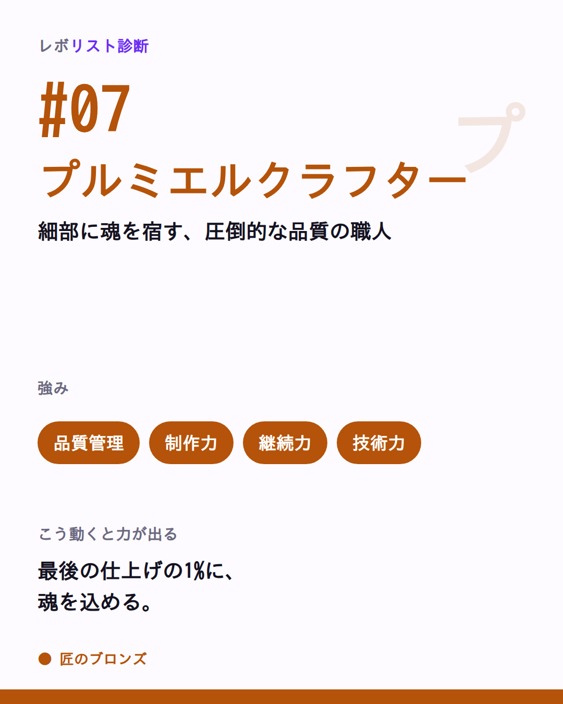
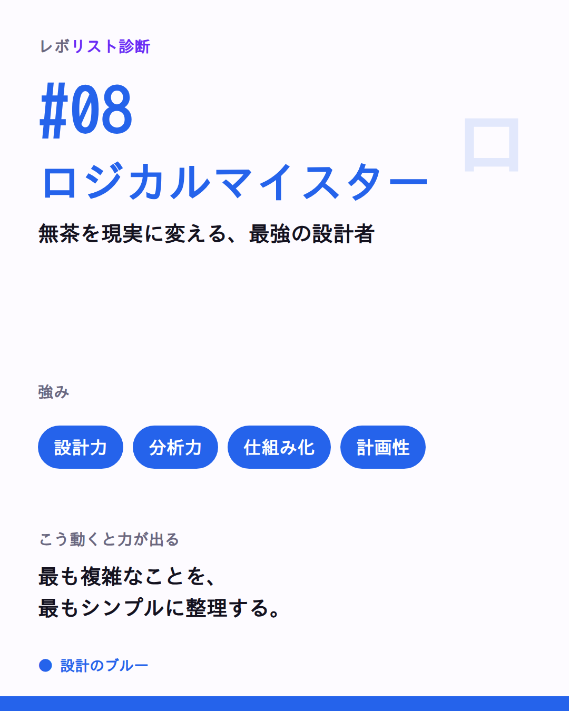
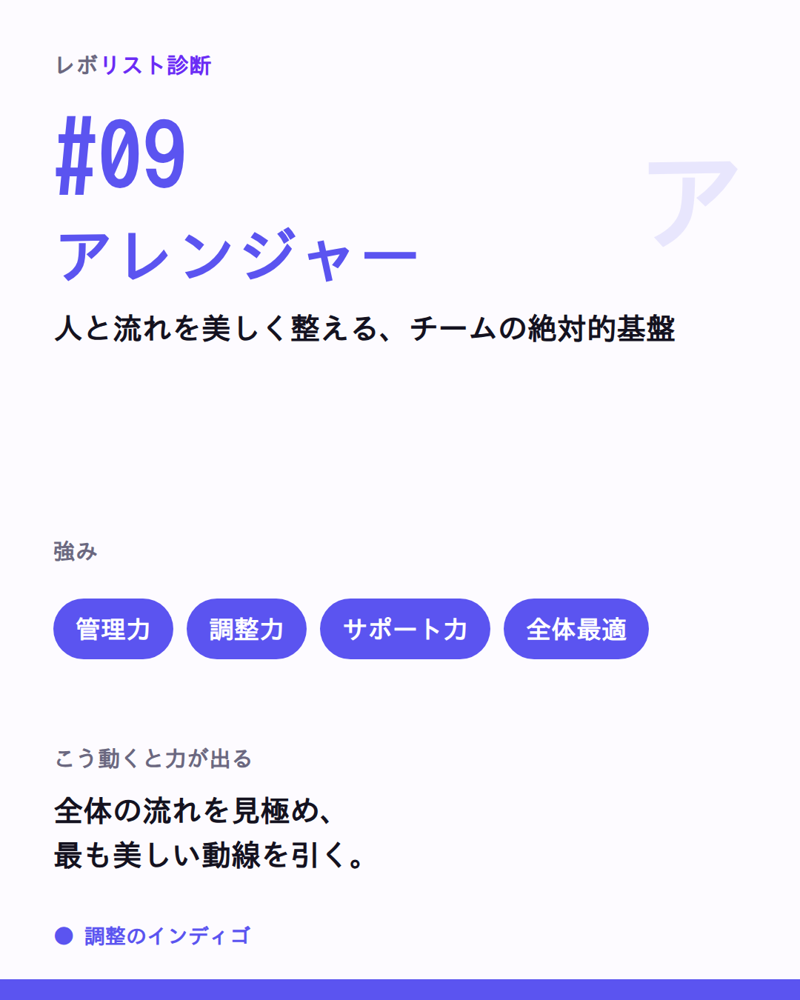
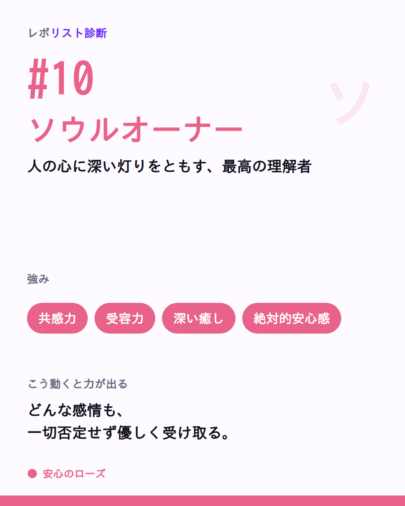
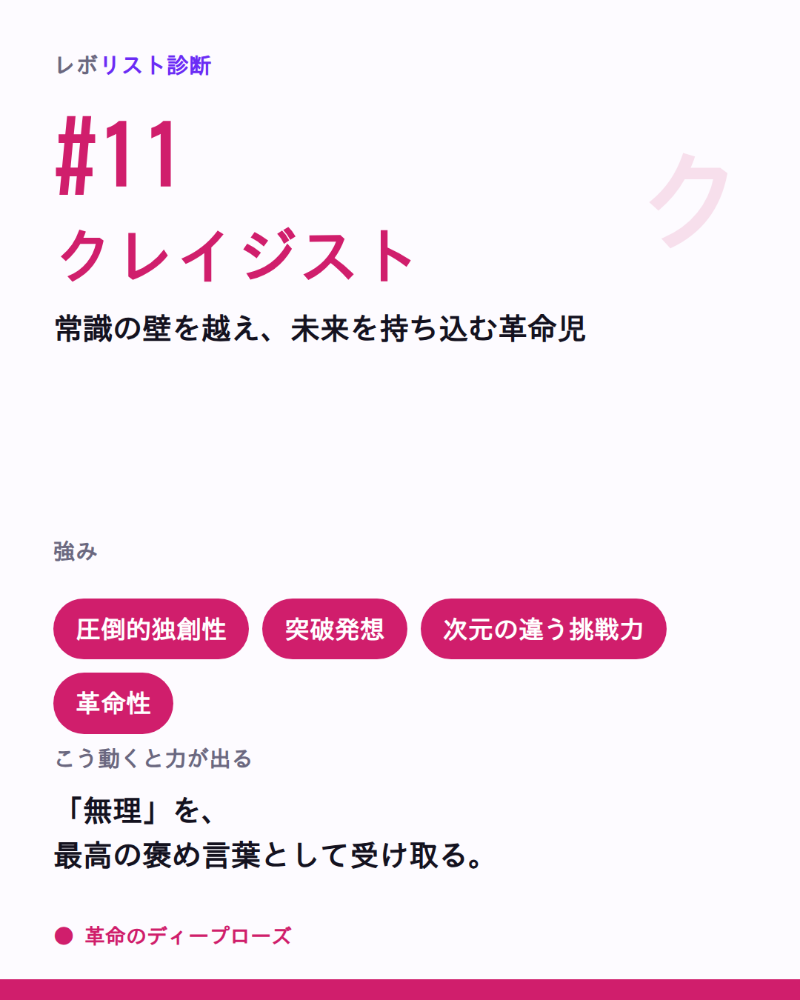

# 🎨 11タイプ投稿パック（11TYPES-PACK）｜1日1タイプ・そのままコピペ

> 文面確定：✍️ ライター部（トンマナ監査：編集長）／画像：🎨 デザイン部 ／ 2026-07
> 元ネタ：`02-posts.md A-01〜A-11`（**本文はこれを正とし改変しない**）・`LAUNCH-PACK.md`（体裁の見本）・`preferences.md §2/§7`
> 対象アカウント：Threads `@____hayator`（**仮置き**）
> ⚠️ **実URL・数値・表示名はすべて仮置き**。公開前に差し替えること（末尾メモ参照）。
> 🚫 git commit/push はしない（つばさが一括）。revolist-diagnosis 以外は触らない。

---

## 使い方（毎日コピペで回す）

- **1日1タイプ**。#01→#11 の順に、1日ひとつずつ出す。
- 添付は **画像1枚**（各ブロックのファイル名を添付）。
- **タグは `#レボリスト診断` の1個だけ**（Threads仕様。本文中の `#自分を推し活` は参加の合言葉＝トピックタグとは別扱い）。
- **締めの問いは必ず残す**（返信＝アルゴリズム最重要）。
- **投稿後60分は返信最優先**。名乗りコメントは1件残らず拾って一言返す。
- **診断リンクは本文に貼らない**。導線は「プロフィールから」に集約。
- 投稿時間の目安は **昼12–14時が基本**（画像で止めて名乗らせる時間帯）。

> これらは全ブロック **柱A（名乗り）**。締めの問いに語り口A「#自分を推し活」を入口の合言葉として**軽く1回だけ**添えてある（LAUNCH-PACK Day1 と同じ体裁）。くどくしない。

---

## #01 レボリスト｜情熱のレッド


- **添付画像**：`01-revolist.png`
- **投稿時間の目安**：昼 **12–14時**
- **タグ**：`#レボリスト診断`

**［そのまま貼る全文］**
```
「まだ誰もやってないから面白い」が口癖の人、いる。

#1 レボリスト｜未踏の地に最初の旗を立てる、世界を動かす火種🔥

▪️強み：突破力・行動力・影響力・挑戦力
▪️渡してるもの：熱量・希望・挑戦のきっかけ
▪️こう動くと力が出る：
　まず動く→道は後から作る。
　理想を熱く語ることが、人を動かす一歩目。

“やれるかも” に場の空気を変える着火剤。
細部を整える仲間と組むと、その推進力は無敵になる。

周りの「レボリストな人」、誰を思い浮かべた？（自分が“これかも”なら #自分を推し活 で名乗ってみて👀）

#レボリスト診断
```

> **⏱ 初速60分リマインド**：60分は返信最優先。「〇〇さんがレボリストっぽい」系には“その人のどこが火種か”を一言添えて返す／自分で名乗ってくれた人は必ず拾って一言（「最初に動ける人だ🔥」）。診断リンクは前に出さない。

---

## #02 マックスデザイナー｜創造のバイオレット



- **添付画像**：`02-maxdesigner.png`
- **投稿時間の目安**：昼 **12–14時**
- **タグ**：`#レボリスト診断`

**［そのまま貼る全文］**
```
「もっと面白くできるはず」が、常に頭の中にあふれてる人。

#2 マックスデザイナー｜可能性を最大化する創造者🎨

▪️強み：発想力・企画力・演出力・未来想像力
▪️渡してるもの：新しい視点・面白さ・圧倒的な可能性
▪️こう動くと力が出る：
　制約を「一番面白い条件」として楽しむ。
　可能性を無限に広げてから、最高の形に絞り込む。

退屈なプロジェクトを、魅力的なものに変える人。
現実化を支える仲間と組むと、アイデアが形になって輝く。

アイデアは湧くのに形にするのが苦手…って人？🙋（“これかも”と思ったら #自分を推し活 で名乗ってみて）

#レボリスト診断
```

> **⏱ 初速60分リマインド**：60分は返信最優先。名乗りコメントは全部拾って「その発想、こんな場面で出てそう」と具体を一言返す。診断リンクは出さない。

---

## #03 イメージマイスター｜感性のマゼンタ



- **添付画像**：`03-imagemaister.png`
- **投稿時間の目安**：昼 **12–14時**
- **タグ**：`#レボリスト診断`

**［そのまま貼る全文］**
```
言葉より先に「なんかいい」「なんか違う」がわかる人。

#3 イメージマイスター｜感性で空気を変える表現者✨

▪️強み：デザイン感覚・感性・演出力・魅せる力
▪️渡してるもの：美しさ・深い感動・圧倒的な世界観
▪️こう動くと力が出る：
　言葉より、美しい空気感で世界に伝える。
　直感を信じて、後から言葉をつける。

その場に「品格」と「世界観」を宿す人。
批評より共感をもらえる場で、表現の羽が大きく広がる。

「センスいいね」って言われると一番うれしいタイプ？（当てはまったら #自分を推し活 でタイプ名だけでも）

#レボリスト診断
```

> **⏱ 初速60分リマインド**：60分は返信最優先。名乗りには「その世界観、こういうところに出てそう」と共感を一言。批評でなく共感で返す。診断リンクは出さない。

---

## #04 コミュニケーター｜調和のシアン



- **添付画像**：`04-communicator.png`
- **投稿時間の目安**：昼 **12–14時**
- **タグ**：`#レボリスト診断`

**［そのまま貼る全文］**
```
あなたがいるだけで、その場の空気がやわらかくなる。

#4 コミュニケーター｜人と人を自然につなぐ、温かい架け橋🌉

▪️強み：対話力・調和力・安心感・巻き込み力
▪️渡してるもの：心地よい会話・絶対的な安心・温かいつながり
▪️こう動くと力が出る：
　まず温かく聞いてから、優しく話す。
　「誰も置いていかない」を一番大切にする。

“ここにいていいんだ” を生み出す人。
本音を受け止めてくれる仲間がいると、さらに自然体で輝く。

気づいたら人の間に入って調整してる、って人？（“これかも”なら #自分を推し活 で名乗ってみて）

#レボリスト診断
```

> **⏱ 初速60分リマインド**：60分は返信最優先。名乗ってくれた人に「その安心感、場を支えてるね」と温かく一言。会話を往復させる。診断リンクは出さない。

---

## #05 インフォレイダー｜探究のエメラルド



- **添付画像**：`05-inforader.png`
- **投稿時間の目安**：昼 **12–14時**
- **タグ**：`#レボリスト診断`

**［そのまま貼る全文］**
```
「なぜ？」を追いかけて、気づけば誰より詳しくなってる人。

#5 インフォレイダー｜情報を武器に未来を読む、最強の羅針盤🧭

▪️強み：情報整理・観察力・リサーチ力・時流把握
▪️渡してるもの：確かな情報・深い洞察・最適な判断材料
▪️こう動くと力が出る：
　まず深く調べてから、確信を持って動く。
　「なぜ？」を問い続けることが最大の力。

チームが迷ったときの羅針盤。
行動を後押しする仲間と組むと、情報が世界を変える武器になる。

調べ始めると時間が溶ける、わかる人？🔍（当てはまったら #自分を推し活 で教えて）

#レボリスト診断
```

> **⏱ 初速60分リマインド**：60分は返信最優先。名乗りには「その探究心、こういう場面で頼られてそう」と一言。深掘り好きどうしを緩くつなぐ。診断リンクは出さない。

---

## #06 ムーブメンター｜熱狂のアンバー



- **添付画像**：`06-movmentor.png`
- **投稿時間の目安**：昼 **12–14時**
- **タグ**：`#レボリスト診断`

**［そのまま貼る全文］**
```
誰かがためらってると、つい背中を押したくなる人。

#6 ムーブメンター｜空気を動かし、人を前へ進める原動力🔥

▪️強み：熱量・応援力・空気づくり・行動促進
▪️渡してるもの：踏み出す勇気・前向きな空気・行動のきっかけ
▪️こう動くと力が出る：
　仲間の小さな前進を絶対に見逃さない。
　自分が前に出なくても、後ろから押す力が世界を動かす。

「やってみよう！」の声を次々生み出す人。
一緒に熱狂できる仲間がいると、何十倍もの力が出る。

人の挑戦を応援するのが自分のことより嬉しい、って人？（“これかも”と思ったら #自分を推し活 で名乗って）

#レボリスト診断
```

> **⏱ 初速60分リマインド**：60分は返信最優先。名乗ってくれた人には、まずこちらが背中を押し返す一言（「その応援、周りを動かしてるね」）。診断リンクは出さない。

---

## #07 プルミエルクラフター｜匠のブロンズ



- **添付画像**：`07-premiercrafter.png`
- **投稿時間の目安**：昼 **12–14時**
- **タグ**：`#レボリスト診断`

**［そのまま貼る全文］**
```
「もう少し良くできる」で、つい手を止められない人。

#7 プルミエルクラフター｜細部に魂を宿す、圧倒的な品質の職人🛠️

▪️強み：品質管理・制作力・継続力・技術力
▪️渡してるもの：最高品質・極めて高い丁寧さ・絶対的な信頼
▪️こう動くと力が出る：
　最後の仕上げの1%に、魂を込める。
　こだわりを、チームの基準として誇り高く共有する。

「この人に任せれば大丈夫」の安心をつくる人。
背中を押す仲間と組むと、その作品が広く世に出る。

完成度が気になって“80点で出す”のが苦手な人？（当てはまったら #自分を推し活 でタイプ名を）

#レボリスト診断
```

> **⏱ 初速60分リマインド**：60分は返信最優先。名乗りには「その丁寧さ、信頼になってるね」と一言。こだわりを肯定して受け止める。診断リンクは出さない。

---

## #08 ロジカルマイスター｜設計のブルー



- **添付画像**：`08-logicalmaister.png`
- **投稿時間の目安**：昼 **12–14時**
- **タグ**：`#レボリスト診断`

**［そのまま貼る全文］**
```
無茶なアイデアを「実現可能な計画」に変えられる人。

#8 ロジカルマイスター｜無茶を現実に変える、最強の設計者📐

▪️強み：設計力・分析力・仕組み化・計画性
▪️渡してるもの：強靭な構造・絶対的な安定・確実な実現性
▪️こう動くと力が出る：
　なぜそうなるかを、根本から解き明かす。
　最も複雑なことを、最もシンプルに整理する。

混乱から秩序を生む人。チームが倒れない“骨格”をつくる。
熱量を持つ仲間と組むと、設計図が世界で動き出す。

会議中に頭の中で構造を整理しちゃう、って人？（“これかも”なら #自分を推し活 で名乗ってみて）

#レボリスト診断
```

> **⏱ 初速60分リマインド**：60分は返信最優先。名乗りには「その整理力、みんなが助かってるね」と一言。構造好きどうしをつなぐ。診断リンクは出さない。

---

## #09 アレンジャー｜調整のインディゴ



- **添付画像**：`09-arranger.png`
- **投稿時間の目安**：昼 **12–14時**
- **タグ**：`#レボリスト診断`

**［そのまま貼る全文］**
```
あなたがいないと、プロジェクトは1ミリも進まない。

#9 アレンジャー｜人と流れを美しく整える、チームの絶対的基盤🧩

▪️強み：管理力・調整力・サポート力・全体最適
▪️渡してるもの：圧倒的な安定・美しい流れ・最高の安心感
▪️こう動くと力が出る：
　全体の流れを見極め、最も美しい動線を引く。
　調整は早いほど価値が高い。即座に動く。

滞った流れをなめらかにする、チームのインフラ。
感謝の連鎖の中で、その調整力は強力な推進力に変わる。

気づいたら全体の段取りを組んでる、って人？（当てはまったら #自分を推し活 で教えて）

#レボリスト診断
```

> **⏱ 初速60分リマインド**：60分は返信最優先。名乗ってくれた人にはまず感謝を一言（「その段取り、いつも支えになってるね」）。診断リンクは出さない。

---

## #10 ソウルオーナー｜安心のローズ



- **添付画像**：`10-soulowner.png`
- **投稿時間の目安**：昼 **12–14時**
- **タグ**：`#レボリスト診断`

**［そのまま貼る全文］**
```
誰かの心の奥の感情に、真っ先に気づいてしまう人。

#10 ソウルオーナー｜人の心に深い灯りをともす、最高の理解者🕯️

▪️強み：共感力・受容力・深い癒し・絶対的安心感
▪️渡してるもの：究極の安心・深い優しさ・すべてを受け入れる居場所
▪️こう動くと力が出る：
　どんな感情も、一切否定せずに優しく受け取る。
　じっくり人と向き合う時間こそが最大の価値を生む。

“誰もが安心して帰ってこられる場所” をつくる人。
自分も安心できる場を持つと、愛のキャパは無限になる。

人の相談に乗ってると時間を忘れる、って人？（“これかも”と思ったら #自分を推し活 で名乗って）

#レボリスト診断
```

> **⏱ 初速60分リマインド**：60分は返信最優先。名乗ってくれた人を、まずこちらがまるごと受け止める一言（「その受け止め方、安心をつくってるね」）。診断リンクは出さない。

---

## #11 クレイジスト｜革命のディープローズ



- **添付画像**：`11-crazist.png`
- **投稿時間の目安**：昼 **12–14時**
- **タグ**：`#レボリスト診断`

**［そのまま貼る全文］**
```
「なぜみんなそのやり方で納得できるの？」がずっと消えない人。

#11 クレイジスト｜常識の壁を越え、未来を持ち込む革命児🚀

▪️強み：圧倒的独創性・突破発想・次元の違う挑戦力・革命性
▪️渡してるもの：最高の驚き・次元の違う発想・未来へのワクワク
▪️こう動くと力が出る：
　「それは無理」を最高の褒め言葉として受け取る。
　失敗は最高の実験データであり、成功への伏線。

不可能の壁を一瞬で壊す人。
形に整えてくれる仲間と組むと、その才能は歴史を変える。

「普通そうする」に一番モヤっとするタイプ？（当てはまったら #自分を推し活 でタイプ名だけでも）

#レボリスト診断
```

> **⏱ 初速60分リマインド**：60分は返信最優先。名乗りには「その視点、みんなが気づけないところを見てるね」と一言。独創を面白がって返す。診断リンクは出さない。

---

## タグ・トーンの厳守メモ

- **トピックタグは各ブロック1個**＝`#レボリスト診断` のみ。本文中の `#自分を推し活` は参加の合言葉（`preferences.md §7`）で、トピックタグとは別扱い＝1投稿1タグの原則を満たす。
- **語り口A「#自分を推し活」**：柱A（名乗り）限定で、各ブロックの締めの問いに**軽く1回だけ**。くどくしない。
- **A-0N本文は改変しない**：フック＋本文は `02-posts.md` の該当ブロックから無改変で移植。締めの問いへの合言葉付与と体裁のみ調整。
- **#01 は LAUNCH-PACK Day1 と一致**（締めの問い・合言葉まで同一）。二重運用時に食い違わない。
- **ネガ表現ゼロ／優劣なし**：禁止語（相性が悪い／向いていない／弱点／欠点／失敗／劣る）ヒットなし。全タイプを主役に。
- **Revoは本文に出さない**（“出口”のまま）。診断リンクも本文に貼らず、導線はプロフィールに集約。
- **「世界一」は本文で不使用**。断定リスクなし。

## 仮置き（要差し替え）注記

> **実URL・数値・表示名はすべて仮置き**。公開前に確定値へ差し替えること。

| 項目 | 現状（仮置き） | 差し替え先 |
|---|---|---|
| 診断本番URL（プロフィールリンク） | `https://（診断本番ドメイン）/diagnosis?src=threads` | onokun.com 系で確定次第。**`?src=threads` は必ず維持** |
| アカウント名 | `@____hayator` | 既存確定値に差し替え |
| 表示名／bio | `21-profile.md` 参照 | 最終確定値に差し替え |

> ✅ 診断リンクは投稿本文に貼らず、プロフィール欄に集約。
