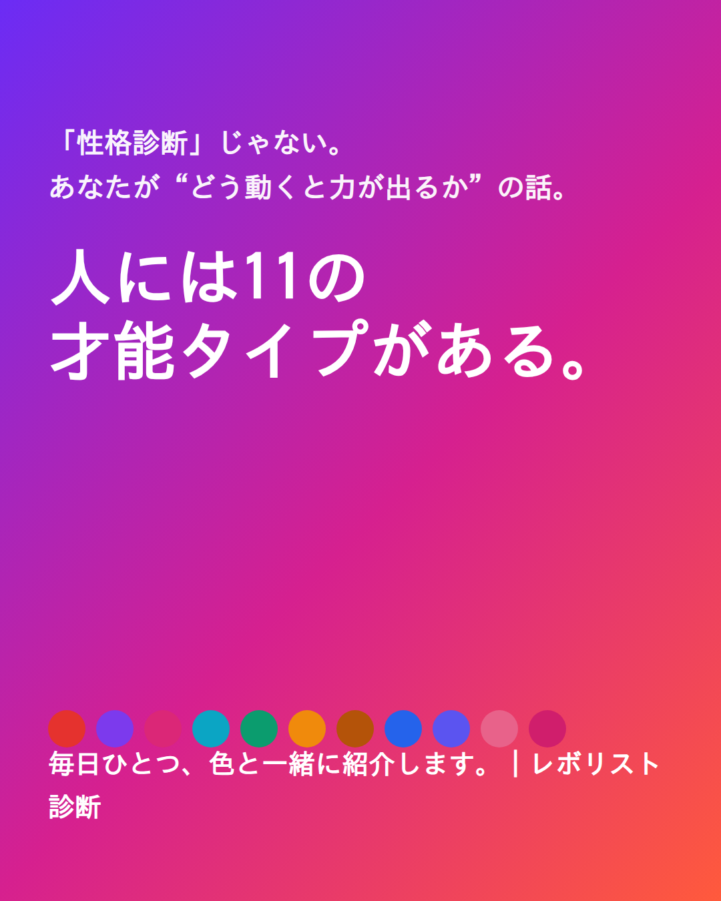
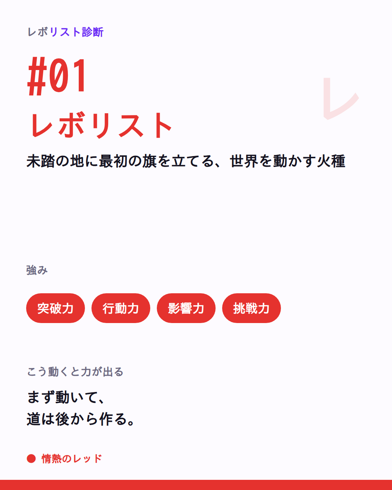
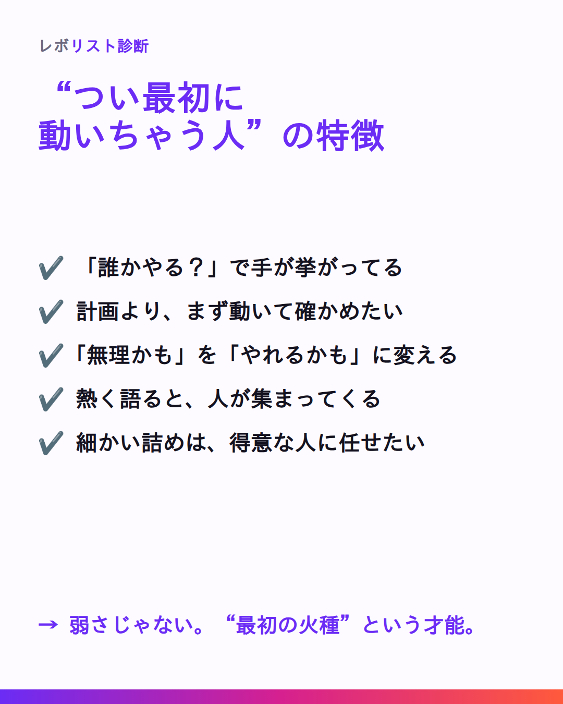

# 🚀 初回投稿パッケージ（LAUNCH-PACK）｜そのまま投稿できる1枚

> 編集：編集長（トンマナ監査済み）／文面確定：✍️ ライター部／画像：🎨 デザイン部 ／ 2026-07
> 対象アカウント：Threads `@____hayator`（**仮置き**）
> 元ネタ：`21-profile.md §1〜§6`・`02-posts.md A-01/B-01`・`20-broadcast-axis.md §1.1`・`preferences.md §2/§7`
> ⚠️ **実URL・数値・表示名はすべて仮置き**。末尾の「仮置き一覧」を公開前に差し替えること。
> 🚫 git commit/push はしない（つばさが一括）。revolist-diagnosis 以外は触らない。

---

## 使い方（3ステップ）

上から順に実行すれば投稿できます。

### STEP ① プロフィールを整える（最初に1回だけ）

| 項目 | 反映する内容 | 出典 |
|---|---|---|
| 表示名 | `レボリスト診断｜11タイプで仲間を見つける`（**要最終確定**・下の仮置き一覧参照） | `21-profile.md §1 案A` |
| bio | `21-profile.md §2 bio案④`（“自分を推し活”入口／Day1と語り口が揃う） | `21-profile.md §2` |
| アイコン | 白い旗（レボバイオレット地）＝ `21-profile.md §6.6` のSVGを512×512で書き出し | `21-profile.md §6.2 案A` |
| バナー／帯 | レボスペクトラム帯 `#6B2CF5→#D6208F→#FF5A3C` | `21-profile.md §6.3` |
| プロフィールリンク | 診断URL＋`?src=threads`（**本番ドメイン確定後に差し替え**。本文には貼らない） | `21-profile.md §4` |

### STEP ② 下の「① 固定投稿」を投稿して **pin（固定）** する

- 添付画像：`cover.png` を1枚。
- 投稿後、Threadsの投稿メニューから「プロフィールに固定」を選ぶ。

### STEP ③ 下の「② Day1」を投稿する

- 添付画像：`01-revolist.png` を1枚。
- 固定投稿と同日に出すなら **4時間以上あけて** 2投稿目に。
- 「③ 予備」は在庫。第2段（会話）の口火として、翌日以降の夜に使う。

> **全ブロック共通の厳守事項**
> - タグは **1投稿1個**（Threads仕様）。主軸は `#レボリスト診断`。
> - 診断リンクは **本文に貼らない**（初速が落ちる）。導線は「プロフィールから」に集約。
> - 投稿後は **初速60分**が勝負。張り付いて全コメントに一言返す（各カードのリマインド参照）。

---

## ① 固定投稿（pinned）｜シリーズ予告＋仲間募集



- **添付画像**：`cover.png`
- **投稿時間の目安**：昼 **12–14時**（人目に付く時間に出して、その日の返信対応に張り付ける）。
- **タグ**：`#レボリスト診断`

**［そのまま貼る全文］**
```
人の才能は11タイプ。ここは、自分のタイプを“推し活”して、そのまま“仲間”が見つかる場所です。

「性格診断」じゃない。
“あなたはどう動くと力が出るか” を知る話。

・最初に旗を立てる人
・場の空気を動かす人
・裏で全部を整える人
・人の心に灯りをともす人
…全部で11タイプ。優劣はなし、全員が主役。

まずは、自分のタイプを“推し活”しよう。
どのタイプで名乗ってくれても、まるごと肯定して受け止めます。

このアカウントでやること👇
・毎日ひとつ、タイプを色と一緒に紹介
・「この2人、相性いい」の組み合わせ＆チーム設計
・一緒に発信を楽しむ“タイプ仲間”を募集中🙌

旗印はひとつ——「一人の特性を、みんなの力に変える。」
まずプロフィールから診断して、
#自分を推し活 で自分のタイプをコメントで教えてください。

あなたは、どのタイプだと思う？👀（#自分を推し活 でタイプ名だけでも！）

#レボリスト診断
```

> **⏱ 初速60分リマインド**：投稿後60分は張り付き。**名乗りコメントは1件残らず拾って一言返す**（例：「レボリストっぽい！最初に動ける火種だね🔥」）。名乗ってくれた人のハンドルは仲間名簿にメモ（1行目）。診断リンクは本文に出さない＝導線は「プロフィールから」。

---

## ② Day1 投稿｜A-01 レボリスト（11タイプの1人目）



- **添付画像**：`01-revolist.png`
- **投稿時間の目安**：昼 **12–14時**（画像で止めて名乗らせる）。固定投稿と同日なら4時間以上あけて2投稿目に。
- **タグ**：`#レボリスト診断`

**［そのまま貼る全文］**
```
「まだ誰もやってないから面白い」が口癖の人、いる。

#1 レボリスト｜未踏の地に最初の旗を立てる、世界を動かす火種🔥

▪️強み：突破力・行動力・影響力・挑戦力
▪️渡してるもの：熱量・希望・挑戦のきっかけ
▪️こう動くと力が出る：
　まず動く→道は後から作る。
　理想を熱く語ることが、人を動かす一歩目。

“やれるかも” に場の空気を変える着火剤。
細部を整える仲間と組むと、その推進力は無敵になる。

周りの「レボリストな人」、誰を思い浮かべた？（自分が“これかも”なら #自分を推し活 で名乗ってみて👀）

#レボリスト診断
```

> **⏱ 初速60分リマインド**：60分は返信最優先。**「〇〇さんがレボリストっぽい」系には“その人のどこが火種か”を一言添えて返す**／自分で名乗ってくれた人は必ず拾って一言（「最初に動ける人だ🔥」）。会話が続いたら第2段（あるある）へ橋渡し。この投稿でも診断リンクは前に出さない。

---

## ③ 予備｜よくある特性（あるある・共感）



- **添付画像**：`common-traits.png`
- **使いどころ**：固定＋Day1のあと、第2段（会話／柱B）の口火として。Day1のレボリストと地続き。
- **投稿時間の目安**：夜 **20–22時**（テキスト主体のあるある＝夜の会話帯）。
- **タグ**：`#レボリスト診断`
- ⚠️ 柱B＝共感の段。**語り口A「#自分を推し活」はここでは使わない**（合言葉は柱A限定）。

**［そのまま貼る全文］**
```
“つい最初に動いちゃう人”、実はこういう才能です。

✔️ 「誰かやる？」で無意識に手が挙がってる
✔️ 完璧な計画より、まず動いて確かめたい
✔️ 「無理かも」の空気を「やれるかも」に変えがち
✔️ 熱く語ると、なぜか人が集まってくる
✔️ 細かい詰めは…得意な人と組むと、もっと伸びる

これ、“最初の火種”っていう才能。
足りないところは、違う強みを持つ人が引き出してくれる。

いくつ当てはまった？（コメントで数字だけでも👀）

#レボリスト診断
```

> **⏱ 初速60分リマインド**：60分は返信最優先。**数字コメントには「その火種、こういう場面で出てそう」と具体を1つ返して会話を往復させる**。似た感覚の人どうしを緩くつなぐ。強いCTA・診断リンクは出さない（会話の居心地づくりの段）。

---

## 仮置き（要差し替え）一覧

公開前に、以下を実確定値へ差し替える。

| # | 項目 | 現状（仮置き） | 差し替え先 |
|---|---|---|---|
| 1 | 診断本番URL（プロフィールリンク） | `https://（診断本番ドメイン）/diagnosis?src=threads` | onokun.com 系で確定次第。**`?src=threads` は必ず維持**（Threads流入計測用） |
| 2 | 表示名 | `レボリスト診断｜11タイプで仲間を見つける`（案A） | 案A/B/C から最終確定（`21-profile.md §1`） |
| 3 | アカウント名 | `@____hayator` | 既存確定。将来ブランド用は取り置き案あり（`21-profile.md §1`） |
| 4 | bio | `21-profile.md §2 bio案④`（推奨） | 案①〜⑤から最終確定 |

> ✅ 診断リンクは投稿本文に貼らず、プロフィール欄に集約（`21-profile.md §4`）。
> ✅ 「世界一」は姿勢語のみ・事実断定しない／「贈り物」は看板化しない（okurimono混線回避・`preferences.md §7`）。

---

## トンマナ監査結果（編集長）

- **禁止語チェック**（`相性が悪い|向いていない|弱点|欠点|失敗|劣る`）：本パッケージ内に**ヒットなし**。ネガはすべてポジ反転済み（「足りないところは、違う強みを持つ人が引き出してくれる」「得意な人と組むと伸びる」）。
- **タグ**：トピックタグは各投稿とも**1個**（`#レボリスト診断`）。本文中の `#自分を推し活` は参加の合言葉（`preferences.md §7`／`20-broadcast-axis.md §1.1`）で、トピックタグとは別扱い＝1投稿1タグの原則は満たす。
- **Revo**：本文に**未登場**（“出口”のまま。導線はプロフィール診断のみ）。
- **「世界一」**：本文で不使用（コピペ全文から除外済み）。断定リスクなし。
- **旗（核メッセージ）**：「一人の特性を、みんなの力に変える。」を固定投稿で保持。
- **語り口A「#自分を推し活」**：柱A（①固定・②Day1の名乗り）限定で使用。柱B（③予備）では不使用。
