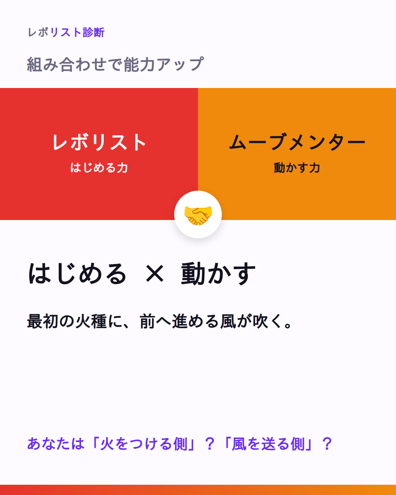
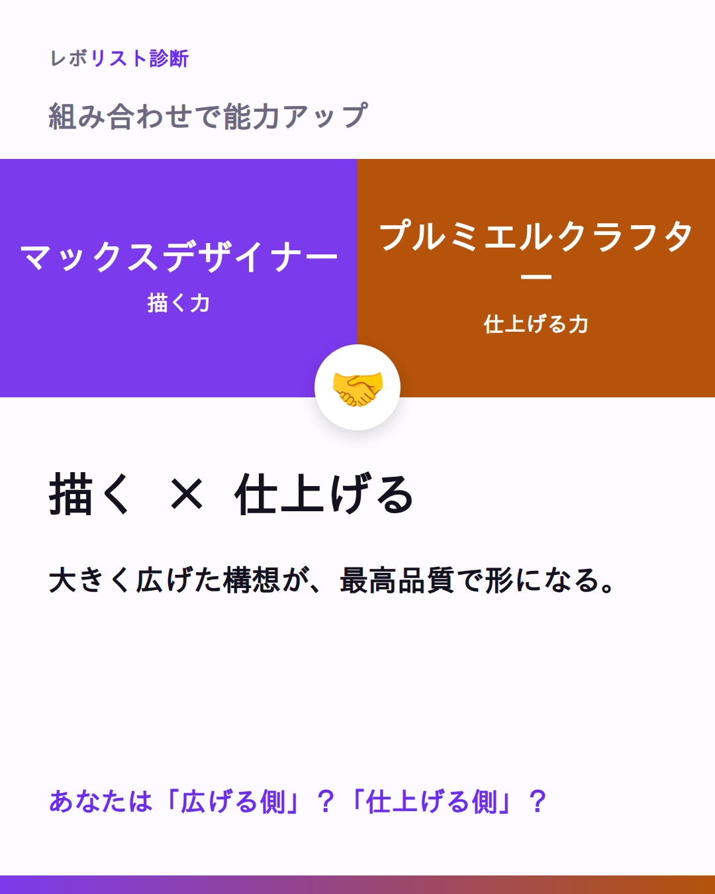
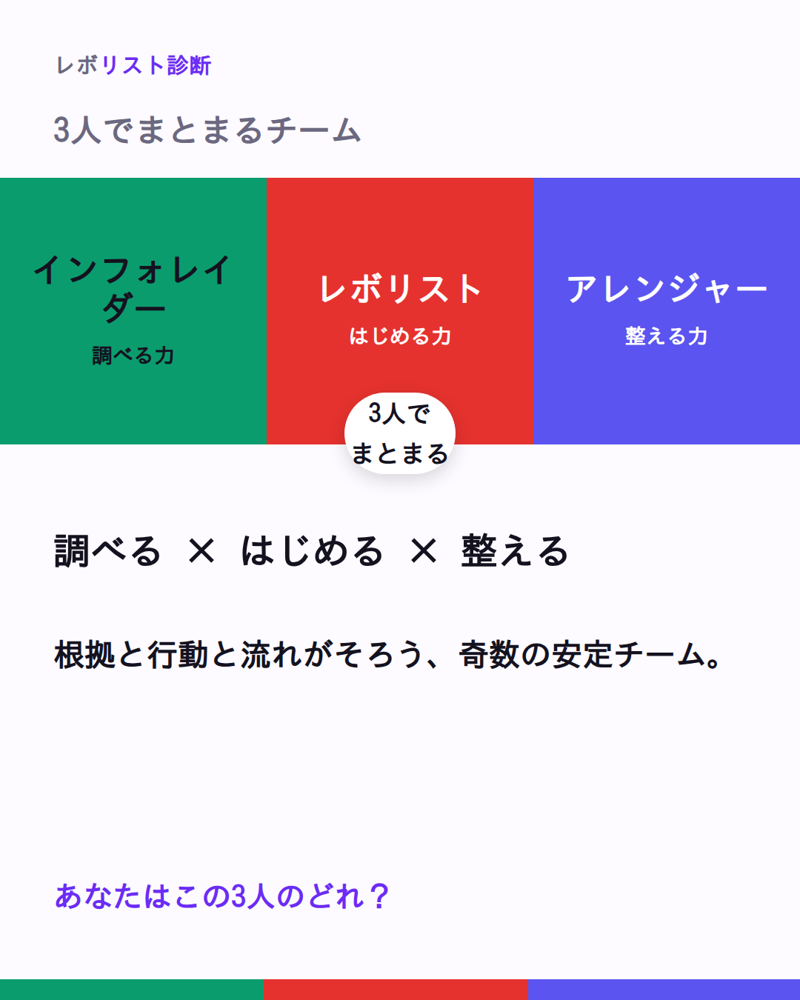

# 📦 Week3 投稿パック（WEEK3-PACK）｜7投稿・そのままコピペ

> 文面確定：✍️ ライター部（トンマナ監査：編集長）／画像：🎨 デザイン部 ／ 2026-08
> 元ネタ：`CONTENT-ENGINE.md §2/§3`（週次ローテ・バックログ W3-01〜07）・`combinations.ts`／`revotypes.ts`（実データ）・`11TYPES-PACK.md`（体裁の見本）・`preferences.md §2/§7`
> 対象アカウント：Threads `@____hayator`
> 期間：**Week3＝7/30(木)〜8/5(水)**（1日1投稿基準・6投稿＋月再カット計7投稿）
> 🚫 git commit/push はしない（つばさが一括）。revolist-diagnosis 以外は触らない。

---

## 使い方（1日1投稿で回す）

- **1日1投稿**。W3-01→W3-07 の順に、割り当て日時（各ブロック記載）で予約する。
- 添付は **画像1枚**（柱C・柱Aのみ）。柱B・クイズは**画像なし＝テキスト投稿**。
- **タグは `#レボリスト診断` の1個だけ**（Threads仕様。本文中の `#自分を推し活` は柱A限定の合言葉＝トピックタグとは別扱い）。
- **締めの問いは必ず残す**（返信＝アルゴリズム最重要）。
- **投稿後60分は返信最優先**（初速オペ）。名乗り・「わかる」は1件残らず拾って一言返す。
- **診断リンクは本文に貼らない**。導線は「プロフィールから」に集約。
- 時間帯：柱C(画像)・柱A＝**昼12–14**／柱B・クイズ＝**夜20–22**（同日2投稿は今週なし）。予約日時は **±調整可**。

> 実データ準拠：柱C＝`combinations.ts` の該当ペア／3人チーム＝`revotypes.ts teamDesign`／柱B＝`revotypes.ts currentEnvTips`。フックと本文は**ライター確定を無改変**で移植。

---

## W3-01｜柱C 相性：レボリスト × ムーブメンター



- **対象柱**：C（相性）／主軸・火・昼
- **添付画像**：`w3-01_revolist-x-movmentor.png`（2色カード＝レボリスト赤 `#dc2626` × ムーブメンター橙 `#d97706`）
- **予約日時(JST)**：**7/30(木) 12:30**（±調整可）
- **タグ**：`#レボリスト診断`
- **ネタ元**：`combinations.ts` `revolist-movmentor`「熱量が熱量を呼ぶ、循環の中心」／`revotypes.ts` revolist.goodWithDetail.movmentor

**［そのまま貼る全文］**
```
ひとりの熱は空回りする日がある。でも、もうひとつの熱が重なると——

🔴 レボリスト（はじめる熱）
🧡 ムーブメンター（応援する熱）

レボリストの「まず動く」熱量は、
ひとりだと、たまに空回りする。

そこにムーブメンターの「一緒にやろう」が重なると——
熱が熱を呼んで、周囲を巻き込む循環が生まれる。

片方が火を灯し、片方が風を送る。
ふたつの熱が掛け合わさると、止まらない推進力になる。

あなたは、火を灯す側？ 風を送る側？

#レボリスト診断
```

> **⏱ 初速60分リマインド**：60分は返信最優先。「火を灯す側」「風を送る側」どちらの名乗りにも“その熱が周りをどう動かすか”を一言添えて返す。診断リンクは前に出さない。

---

## W3-02｜柱B あるある：マックスデザイナー（今いる環境Tipsの角度）

- **対象柱**：B（あるある／今いる環境での活かし方）・水・夜／**画像なし（テキスト投稿）**
- **予約日時(JST)**：**7/31(金) 20:30**（±調整可）
- **タグ**：`#レボリスト診断`
- **ネタ元**：`revotypes.ts` maxdesigner.currentEnvTips
- **重複回避**：`11-copy-stock B10-02`（内面あるある5連）とは角度違い＝「今ある環境での実践」に着地

**［そのまま貼る全文］**
```
会議で「それ、もっと面白くできない？」が、つい口から出る人へ。

🎨 マックスデザイナーの「今いる環境」での活かし方

・会議で「もっと面白くするなら？」と一歩先の問いを置く
・決まった案に、発展案をそっと一つ足す
・「これ、もっと魅力的にできないかな」を口ぐせにする

コツは、否定じゃなくて「上乗せ」。
今いる場所でも、その視点があるだけで空気が動き出す。
あなたの一問が、退屈を「面白い」に変えていく。

この3つ、いま自分はいくつやってる？（数字だけでもコメントで👀）

#レボリスト診断
```

> **⏱ 初速60分リマインド**：60分は返信最優先。コメントの「数字」には必ず一言（「その一問、場を動かしてるね」）。数字が小さくても“上乗せの視点があること”を肯定して返す。診断リンクは出さない。

---

## W3-03｜柱C 相性：マックスデザイナー × プルミエルクラフター



- **対象柱**：C（相性）／主軸・木・昼
- **添付画像**：`w3-03_maxdesigner-x-premiercrafter.png`（2色カード＝マックスデザイナー紫 `#7c3aed` × プルミエルクラフター茶 `#92400e`）
- **予約日時(JST)**：**8/1(土) 12:30**（±調整可）
- **タグ**：`#レボリスト診断`
- **ネタ元**：`combinations.ts` `maxdesigner-premiercrafter`「世界観と技術で、本物を作り上げる人／イメージを、手で触れられる現実に変えていく。」

**［そのまま貼る全文］**
```
頭の中の世界観、そのままだと止まりやすい。手を持つ人が横にいると——

🟣 マックスデザイナー（世界観を描く力）
🤎 プルミエルクラフター（技術で仕上げる力）

「もっと面白く」と広がっていく世界観。
そのままだと、頭の中のイメージで止まりやすい。

そこにプルミエルクラフターの技術が入ると——
イメージが、手で触れられる現実に変わる。

世界観と技術が重なるとき、「本物」が生まれる。

あなたは、飛ばす側？ 仕上げる側？

#レボリスト診断
```

> **⏱ 初速60分リマインド**：60分は返信最優先。「飛ばす側」「仕上げる側」どちらの名乗りも“その力が本物をどう生むか”を一言添えて返す。両方が主役。診断リンクは出さない。

---

## W3-04｜参加 クイズ：アレンジャー当て（夜に正解発表）

- **対象柱**：参加（タイプ当てクイズ）・金・夜／**画像なし（テキスト投稿）**
- **予約日時(JST)**：**8/2(日) 20:30**（±調整可）
- **タグ**：`#レボリスト診断`
- **ネタ元**：`revotypes.ts` arranger.strengths／arranger.currentEnvTips／openingText
- **重複回避**：既存クイズ（Q10-01 ムーブメンター／Q10-02 クレイジスト／B-03 ロジカルマイスター）とフックも対象も別。**答え＝アレンジャー**
- **⚠️ 手動運用**：**夜に自分の返信で「正解＝アレンジャー」を発表**して会話ラリーを伸ばす（Buffer外の手動運用）。

**［そのまま貼る全文］**
```
いないと回らないのに、目立たない。この人、11タイプの誰でしょう？

ヒント：
🔹 誰が何をすべきか、先回りして見えてる
🔹 会議で誰も拾わなかった見落としを、そっと拾う
🔹 役割分担を最初にきれいに整理するのが得意
🔹 表に立たなくても、裏で流れが回ってると満たされる

さて、何タイプ？
（正解は夜、このスレッドの返信で発表します）

わかった人、タイプ名をコメントで！

#レボリスト診断
```

> **⏱ 初速60分リマインド**：60分は返信最優先。回答コメントは全部拾い、正解でも惜しくても「その視点いいね」と会話を往復。夜に自分の返信で **正解＝アレンジャー** を発表＝ラリーを伸ばす。診断リンクは出さない。

---

## W3-05｜柱C 3人チーム：インフォレイダー起点（インフォレイダー × レボリスト × アレンジャー）



- **対象柱**：C（3人チーム設計）・土・昼
- **添付画像**：`w3-05_team-inforader.png`（3色カード＝インフォレイダー緑 `#059669` × レボリスト赤 `#dc2626` × アレンジャー藍 `#4f46e5`）
- **予約日時(JST)**：**8/3(月) 12:30**（±調整可）
- **タグ**：`#レボリスト診断`
- **ネタ元**：`revotypes.ts` inforader.teamDesign（bestPair=revolist／thirdPerson=arranger／teamNote に忠実）
- **重複回避**：C10-04（inforader×revolist 2人相性）／C10-05（arranger起点3人）／C-03（revolist起点3人）とは別ペア構成

**［そのまま貼る全文］**
```
「調べる人」が主役の、崩れない3人チームの話。

💚 インフォレイダー（調べて根拠を出す）
🔴 レボリスト（まず動く）
🔷 アレンジャー（流れを整える）

インフォレイダーが集めた、確かな根拠。
そのままだと、動かなければ眠ったまま。

そこへレボリストの「まず動く」熱量が火をつけ、
アレンジャーが流れをなめらかに整えると——
根拠と行動が両立する、崩れない推進システムが完成する。

奇数の3人は、まとまりやすい。

あなたが自然に担うのは、根拠？ 行動？ 流れ？

#レボリスト診断
```

> **⏱ 初速60分リマインド**：60分は返信最優先。「根拠／行動／流れ」の名乗りには“その役割がチームをどう支えるか”を一言。3役どれも主役として返す。診断リンクは出さない。

---

## W3-06｜柱B Tips：コミュニケーター（今いる環境での活かし方）

- **対象柱**：B（今いる環境Tips）・火・夜／**画像なし（テキスト投稿）**
- **予約日時(JST)**：**8/4(火) 20:30**（±調整可）
- **タグ**：`#レボリスト診断`
- **ネタ元**：`revotypes.ts` communicator.currentEnvTips
- **重複回避**：`11-copy-stock B10-04`（あるある）とは角度違い＋締めの問いも別

**［そのまま貼る全文］**
```
気づいたら、みんなの意見をまとめてる人へ。

🩵 コミュニケーターの「今いる環境」での活かし方

・チームで「全員の意見を優しくまとめる役」を楽しむ
・人と人をつなぐ紹介役を、意識してやってみる
・場が止まったとき、一番に温かい一言を出す

特別な肩書きは、いらない。
今いる場所で、その気配りを少し「意識」するだけ。
あなたがいると、みんなが「ここにいていい」と思える。

あなたの“まとめ役スイッチ”、どんな時に入る？

#レボリスト診断
```

> **⏱ 初速60分リマインド**：60分は返信最優先。「まとめ役スイッチ」の答えには「その気配り、場を支えてるね」と温かく一言。会話を往復させる。診断リンクは出さない。

---

## W3-07｜柱A 再カット：レボリスト（突破力の正体／#01と別切り口）


- **対象柱**：A（名乗り再カット）・水・昼
- **添付画像**：`01-revolist.png`（既存流用／表紙コピーは差し替え可）
- **予約日時(JST)**：**8/5(水) 12:30**（±調整可）
- **タグ**：`#レボリスト診断`
- **ネタ元**：`revotypes.ts` revolist.strengths「突破力」の再解釈＋openingText（未来がもう見えている）
- **重複回避**：A-01（初回紹介）／B10-01（あるある5連）とは切り口が別＝「突破力の正体」への再定義
- **語り口**：柱Aのため `#自分を推し活`（本文合言葉）を締めに軽く1回だけ添える

**［そのまま貼る全文］**
```
「突破力がある人」って、実は“こわいもの知らず”じゃない。

#1 レボリスト｜世界を動かす火種🔥

「突破力」の正体は、勇気じゃない。
“未来がもう見えてる”から、待てないだけ。

・「まだ誰もやってない」が、いちばんワクワクする
・完璧な計画より、まず半歩だけ踏み出したい
・「やれるかも」の空気を、自分から作っちゃう

その熱が、周りの一歩目に火をつける。
整える仲間が横にいると、熱はまっすぐ遠くまで届く。

これ、私だ。って人、いる？ #自分を推し活

#レボリスト診断
```

> **⏱ 初速60分リマインド**：60分は返信最優先。「これ私だ」の名乗りは1件残らず拾って「その突破力、周りの一歩目に火をつけてるね」と一言。#自分を推し活 の名乗りを名簿へ。診断リンクは出さない。

---

## タグ・トーンの厳守メモ（監査）

- **トピックタグは各ブロック1個**＝`#レボリスト診断` のみ（Threads仕様・7投稿すべて1タグ）。本文中の `#自分を推し活` は参加の合言葉で、トピックタグとは別扱い。
- **`#自分を推し活` は W3-07（柱A）限定**で締めに軽く1回だけ。他6投稿には登場させない。
- **本文はライター確定を無改変移植**：フック＋本文＋締めの問いは `_wip/week3-text.md` の該当ブロックから改変せずコピー。
- **ネガ表現ゼロ／優劣なし**：禁止語（相性が悪い／向いていない／弱点／欠点／失敗／劣る）ヒットなし。全タイプを主役に。
- **Revoは本文に出さない**（“出口”のまま）。診断リンクも本文に貼らず、導線はプロフィールに集約。
- **手動運用**：W3-04 クイズは夜に自分の返信で「正解＝アレンジャー」を発表（Buffer外）。全投稿で投稿後60分は返信最優先。

## 画像ファイル名（実在ファイルに統一済み）

| 投稿 | 柱 | 画像 | 状態 |
|---|---|---|---|
| W3-01 | C 相性 | `w3-01_revolist-x-movmentor.png` | 生成済み |
| W3-02 | B あるある | 画像なし | テキスト投稿 |
| W3-03 | C 相性 | `w3-03_maxdesigner-x-premiercrafter.png` | 生成済み |
| W3-04 | 参加 クイズ | 画像なし | テキスト投稿 |
| W3-05 | C 3人チーム | `w3-05_team-inforader.png` | 生成済み |
| W3-06 | B Tips | 画像なし | テキスト投稿 |
| W3-07 | A 再カット | `01-revolist.png` | 既存流用 |
